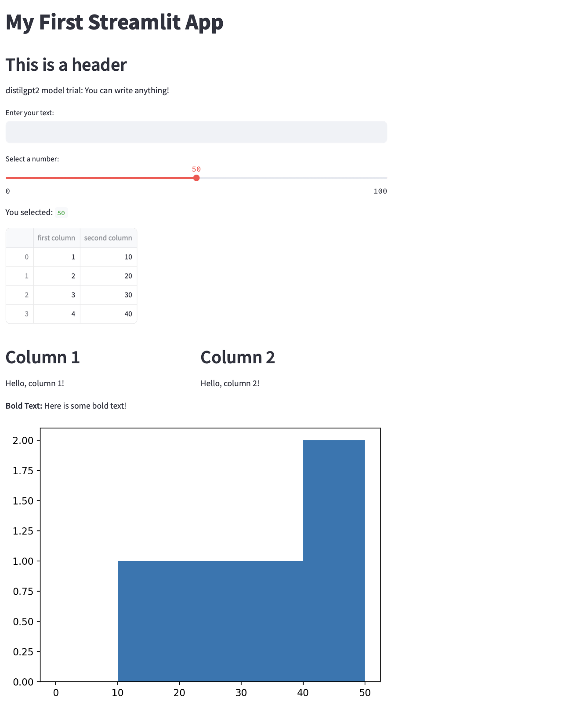

# Section 1: Create a website using Streamlit
1. Step 1: Installation and Setup
    - Install Streamlit
      ```angular2html
      pip install streamlit
      ```
    - Create a New Directory
      ```angular2html
      mkdir streamlit_app
      cd streamlit_app
      ```
    - Create Your First Streamlit Script
      ```angular2html
      touch app.py 
      ```

2. Step 2: Building a Basic Streamlit App
   - Write First Streamlit App
      Open app.py in IDE and write a simple Streamlit app
      ```angular2html
      import streamlit as st
   
      st.title('My First Streamlit App')
      st.header('This is a header')
      st.write('Here is some regular text. You can write anything!')
      ```
   - Run Streamlit App
     ```angular2html
     streamlit run app.py
     ```
     After running `app.py`, we can see as:
   
   
3. Step 3: Enhancing App
    - Add Interactivity: 
      Streamlit provides widgets that allow users to interact with the app
   ```angular2html
   number = st.slider('Select a number:', 0, 100, 50)  # min, max, default
   st.write('You selected:', number)
   ```
   
    - Display Data: 
      Streamlit can easily display data
   ```angular2html
   import pandas as pd
   
   df = pd.DataFrame({
     'first column': [1, 2, 3, 4],
     'second column': [10, 20, 30, 40]
   })
   
   st.write(df)
   ```
   
    - Plotting: 
      Add visualizations using libraries like Matplotlib
   ```angular2html
   import matplotlib.pyplot as plt
   
   fig, ax = plt.subplots()
   ax.hist([10, 20, 30, 40, 50], bins=[0, 10, 20, 30, 40, 50])
   st.pyplot(fig)
   ```
4. Step 4: Customizing Layout and Style
   - Layouts
   ```angular2html
   col1, col2 = st.columns(2)
   
   with col1:
       st.header("Column 1")
       st.write("Hello, column 1!")
   
   with col2:
       st.header("Column 2")
       st.write("Hello, column 2!")
   ```
   
   - Styling
   ```angular2html
   st.markdown('**Bold Text:** Here is some bold text!')
   ```
5. Step 5: Testing and Iterating
   We can now see on our deployed website as:
   


# Section 2: Connect to an open source LLM (Hugging Face)
1. Step 1: Set Up Your Environment
2. Step 2: Choose a Model from Hugging Face\
   For a general-purpose language model, start with something like distilgpt2, a lighter version of GPT-2.
3. Step 3: Integrate the Model with Your App
   - Load the Model
   ```angular2html
   from transformers import pipeline
   
   # Load a text generation model
   generator = pipeline('text-generation', model='distilgpt2')
   ```
   - Create a Text Input Field
   ```angular2html
   user_input = st.text_input("Enter your text:")
   ```
   - Generate Responses
   ```angular2html
   if user_input:
       with st.spinner('Generating...'):
           responses = generator(user_input, max_length=50)
           st.text(responses[0]['generated_text'])
   ```
4. Step 4: Run and Test App\
   by running `streamlit run app.py`, the new website is be like:
   By inputing prompt words, the distilgpt2 model can generate some info from server. The trial example follows as:
   

# Section 3: Deploy model via Streamlit or other service (accessible via browser)
We can deploy our model both on local and network. The relevant link is: \
Local URL: http://localhost:8501 \
Network URL: http://10.198.18.81:8501

The website deployed is looked like:



